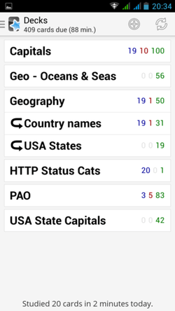
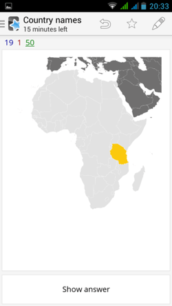
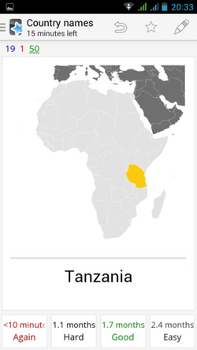

class: full-page, slide-intro
# Techniques de mémorisation
---
class: content-centered
# Timothée Carry

- [@pixelastic][1]
- Consultant [@OctoTechnology][2]
- Expert web front-end
- Équipe Sunrise 3e étage
- Dernier jour

---
class: content-centered
# Sommaire

1. Définition
3. Images mentales
4. Memory Palace
5. Répétition espacée
6. PAO
7. Conclusion
---
class: full-page, slide-definition
# Définition
---
class: content-centered
# Questions

- Pourquoi on oublie ?
- Pourquoi on se rappelle ?
- Pourquoi on l'a sur le bout de la langue ?
- Comment ça marche ?
- Comment l'améliorer ?
---
# Retour d'experience(s)

.column-right[
  
]

.column-left[
 

 

 
- Testé les méthodes
- Ce qui marche
- Ce qui ne marche pas
]
---
class: content-centered
# Checklist

.checklist[
- ☐ pourquoi je viens d'ouvrir le frigo
- ☐ ma liste de courses
- ☐ apprendre plus facilement
- ☐ numeros de téléphone
- ☐ le nom des gens
]
---
class: full-page, slide-mental-image
# Images mentales
---
class: content-centered
# Triangulation

- Graph Database
- Triangulation de l'information
 - _Je m'en souviens_
 - _Je l'ai sur le bout de la langue_
---
class: content-centered
# Accroches fortes

- ## Émotions
- ## 5 Sens
- ## Surprise
---
class: full-page, slide-vader
# 97841578
---
class: content-centered
# I/O

## Écriture

1. Exagérer l'information
2. S'en former une image mentale

## Lecture
1. Se remémorer l'image mentale
2. Déduire l'information originale
---
class: content-centered
# Principes

- Triangulation
- Accroches fortes
- Visualisation
- Surprenant
- Effort à l'enregistrement
---
class: full-page, slide-memory-palace
# Memory Palace
---
class: content-centered
# Spatialisation

- Visite mentale de lieux
- Nombreux lieux en mémoire
- Une pièce = un élément
- Visite toujours dans le même ordre
---
class: content-centered
# Use cases

.center[]

- ✔ Burger de la mort
- ✘ Codes HTTP
---
class: full-page, slide-anki
# Répétition espacée
---
class: content-centered
# Répétition espacée

- Réviser juste avant d'oublier
- 10mn, 3 heures, 2 jours, 1 mois
- GTD-like
- Ludique
---
class: content-centered
# Anki

---
class: full-page, slide-pao
# PAO
---
class: content-centered
# Person / Action / Object

- Liste de 100 PAO
- Personnelle
- A apprendre avec Anki

---
# Exemple

.center[
# 97-84-15 78
]

|        | Person         | Action               | Object                    | 
| ------ | -------------- | -------------------- | ------------------------- | 
| 15     | Poison Ivy     | embrasse             | une plante carnivore      | 
| ...    | ...            | ...                  | ...                       |
| 78     | Joey Tribbiani | a la tête dans       | une dinde de Thanksgiving | 
| ...    | ...            | ...                  | ...                       |
| 84     | Batman         | conduit la batmobile | dans la batcave           | 
| ...    | ...            | ...                  | ...                       |
| 97     | Nathan Drake   | se mets à couvert    | avec une grenade          | 

.center[
Nathan Drake conduit la batmobile (sur) une plante carnivore. 

Joey Tribbiani a la tête dans une dinde de Thanksgiving.
]
---
class: full-page, slide-more
# Conclusion
---
class: content-centered
# Conclusion

- Images mentales
- Répétition espacée
- Mélange de techniques
- Entrainement
- Effort à l'écriture
---
class: content-centered
# Checklist

.checklist[
- ☐ pourquoi je viens d'ouvrir le frigo
- ☑ ma liste de courses
- ☑ apprendre plus facilement
- ☑ numeros de téléphone
- ☐ le nom des gens
]
---
class: full-page, slide-questions

  
tim@

pixelastic
.com

.sources[
- http://finda.photo/image/5870
- http://finda.photo/image/10658
- http://finda.photo/image/9043
- http://finda.photo/image/10575
]

[1]: https://twitter.com/pixelastic
[2]: http://www.octo.com/
