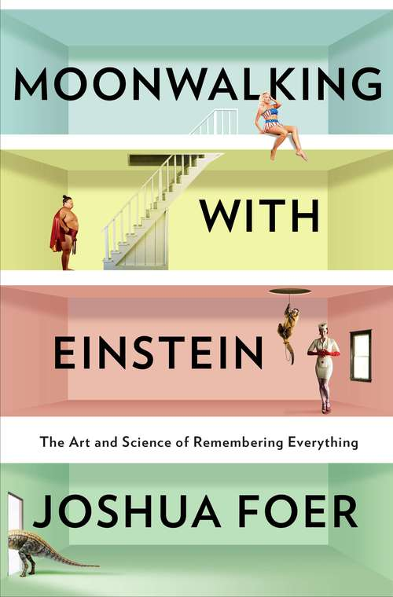
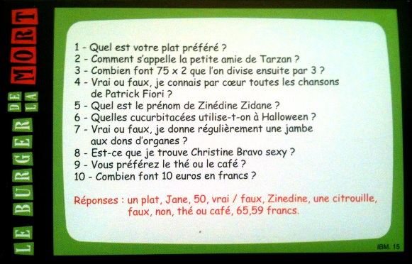
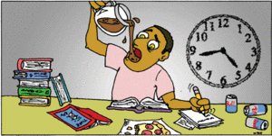
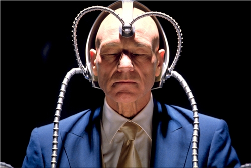
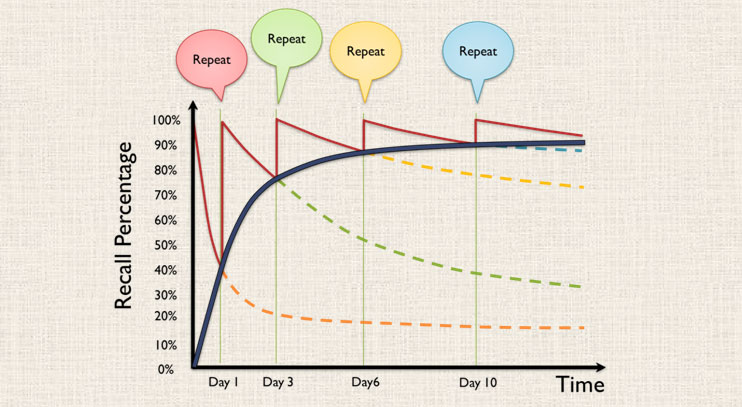
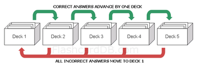
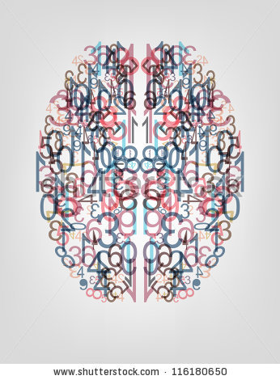

class: full-page, slide-intro
# Techniques de mémorisation
---
class: content-centered
# Sommaire

1. Introduction
3. Images mentales
4. Memory Palace
5. Répétition espacée
6. PAO
7. Conclusion
---

class: full-page, slide-definition
# Définition
---

class: content-centered
# Questions

- Pourquoi on oublie ?
- Pourquoi on se rappelle ?
- Pourquoi on l'a sur le bout de la langue ?
- Comment ça marche ?
- Comment l'améliorer ?
---

# Retour d'experience(s)

.column-right[
  
]

.column-left[
 

 

 
- Testé les méthodes
- Ce qui marche
- Ce qui ne marche pas
]

---

class: content-centered
# Me souvenir...

- ... où j'ai mis mes clés
- ... pourquoi je viens d'ouvrir le frigo
- ... de ma liste de course
- ... des numeros de téléphone
- ... du nom des gens
- ... de ce que j'apprends
---

class: full-page, slide-mental-image
# Images mentales
---

class: content-centered
# Stockage

- Graph Database
- Triangulation de l'information
- Assez d'accroches => _Je m'en souviens_
- Pas assez d'accroches => _Je l'ai sur le bout de la langue_
---

class: content-centered
# Meilleure accroches

## Émotion
  - Joie, Peur, Colère, etc

## Sens
  - Douleur, Image, Bruit, Odeur

## Surprenant
  - Unique, Extravagant, Rare

---

class: full-page, slide-vader
# 97841578
---

class: content-centered
# Enregistrement

1. Extrapoler l'information
2. Se former une image mentale extravagante
3. Se souvenir de l'image mentale
4. ...
5. Se rappeller de l'image mentale
6. Déduire l'information

---

class: full-page, slide-memory-palace
# Memory Palace
---
class: content-centered
# Spatialisation

- Point fort du cerveau
- 2mn dans un appartement
- Visite mentale les yeux fermées
- Centaines de lieux en mémoire
- Un élément (extrapolé) dans chaque pièce

---

class: content-centered
# Use cases

.center[]

- ✔ Burger de la mort
- ✘ Codes HTTP

---

class: full-page, slide-anki
# Répétition espacée
---

# Répétition espacée

## Level 1 : Le mec qui bachote
.center[]

 

.left[ Efficace à très court terme ]
.left[ Inefficae à moyen/long terme ]

---

# Répétition espacée

## Level 2 : Le mec sérieux
.center[]

 

.left[ Efficace à court/moyen terme ]
.left[ Inefficace à long terme ]
.left[ Perte de temps ]

---

# Répétition espacée

## Level 3 : Le mec efficace
.center[]

 

.left[ Efficace à court/moyen terme ]
.left[ Efficace à long terme ]

---

# Répétition espacée

## Pourquoi le level 3 est plus efficace ?

.center[]

---

# Répétition espacée

## Le système

.center[]

- La carte apparait quand on l'oublie
- Côté rassurant à la GTD

---
# Répétition espacée

## L'outil indispensable : Anki

- Multi-plateforme( Mobile, web, linux, windows, ...)
- Très customizable (son, latex, ...)
- Simple à utiliser
- Synchro multidevice

---
# Répétition espacée

## Mon REX

- Ajouter seulement ce qui est déjà compris
- Utiliser tous ce qui peut aider à la mémorisation (Mnemotechniques, images, métaphores ...)
- Pas plus de 20sec par carte
- Commencer doucement (15 min par jour)
- En faire une habitude (dans le métro, ou dans les files d'attentes)
- Faire ses propres cartes

---
# PAO

## L'objectif

.center[]

---

# PAO

## Le principe

- PAO = Person + Action + Object

## Exemple
0  Hercules soulève pierre
 
1  Einstein écrit tableau noir
 
25  Père Noel dépose cadeaux
 
43  Johny Haliday sniff coke
 
51  Amy Winehouse boit de l'alcool
 

00 25 43 -> Hercule dépose coke
 
51 43 01 -> Amy Winehouse sniff pierre
 

---
# PAO

## Verdict

- Pas eu le temps d'aller jusqu'au bout de l'experimentation
- Mettre en place un système prend du temps
- Possibilité de coupler avec le Memory Palace

---

# Les champions

- Championnats du monde de mémoire
- Liste de photos de gens + noms
- Mémorisation de jeu de carte
- Retenir PI -> memory palace
- Pas vraiment de génies, c'est surtout de l'entrainement, comme les sportifs

---

class: content-centered
# Me souvenir...

- ✘ où j'ai mis mes clés
- ✘ pourquoi je viens d'ouvrir le frigo
- ✔ de ma liste de course
- ✔ des numeros de téléphone
- ✘ du nom des gens
- ✔ de ce que j'apprends
---

class: content-centered
# Conclusion

- Il n'y a pas de magie
- Mémoire interne vs Mémoire externe (livre, notes, pc, téléphone) plus facile.
- Reste un effort à faire
- Nos deux WHAOU : Anki / association image

---
class: content-centered
# Achievements

- On sait placer tous les pays du monde, leurs drapeaux et leurs capitales
- Appris vocabulaire, sait gagner au burger Quizz
- On sait qu'on sait retenir

---
class: full-page, slide-questions
# Questions ?
---

# Sources

http://finda.photo/image/5870

