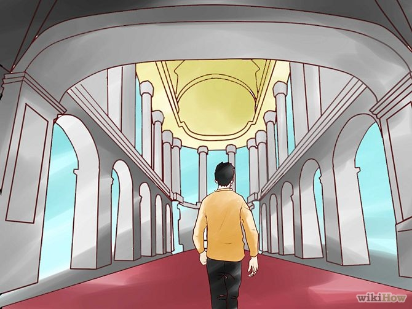

# Memory
---

# Sommaire

1. Introduction
3. Images mentales (TCA)
4. Memory Palace (TCA)
5. Anki (THV)
6. PAO
7. Conclusion
---

# Introduction

> Pourquoi on oublie ?
> Pourquoi on se rappelle ?
> Pourquoi on l'a sur le bout de la langue ?
> Comment ça marche ?
> Comment l'améliorer ?
---

## Objectifs

- Me souvenir où j'ai mis mes clés ?
- Me souvenir pourquoi je viens d'ouvrir le frigo ?
- Me souvenir des digicodes, numero de carte bleu, numero de téléphone ?
- Me souvenir de ma liste de course
- Me souvenir du nom des gens
- Me souvenir de ce que j'apprends
---

## REX

Moonwalking with Einstein
THV + TCA
Appris plein de trucs, partage
Testé les méthodes
- Ce qui marche
- Ce qui ne marche pas
- Autres méthodes
---

# Images mentales

## Stockage de la mémoire
On range pas dans des cases. Je sais/Je sais pas, pas si simple
On a un graph
On triangule l'information
Phénomène du "je l'ai sur le bout de la langue"
Assez d'accroches, on s'en souvient

## Accroches plus marquantes

lié à une émotion
lié à un évenement marquant
  trivial = pas de souvenir
  trivial different selon les gens
lié à une musique, une image

## Plus facile image que chiffres abstraits

Mmontre chiffre, puis montre image. Quel est plus simple à retenir ?
élément principal du livre, de la part tout le reste

création d'images mentales
Exemple: Capitales USA. Raleigh/Columbia Caroline Nord/Sud

## Major System
Associer une consonne à chaque chiffre
0 = s, z,
1 = t, d
2 = n
3 = m
4 = r
5 = l
6 = j, ch
7 = k, g
8 = f, v
9 = p, b

FAIL, marche pas pour moi

---

# Memory Palace - c'est quoi ?

---

## Use cases

### Success

 - Liste de course
 - Burger Quizz
 - Presentation
 - Todo list

### Fail

 - Code http

### Limite
 - On a pas souvent besoin de retenir une liste ...

---

# Répétition espacée

## Level 1 : Le mec qui bachote
.center[]

 

.left[ Efficace à très court terme ]
.left[ Inefficae à moyen/long terme ]

---

# Répétition espacée

## Level 2 : Le mec sérieux
.center[]

 

.left[ Efficace à court/moyen terme ]
.left[ Inefficace à long terme ]
.left[ Perte de temps ]

---

# Répétition espacée

## Level 3 : Le mec efficace
.center[]

 

.left[ Efficace à court/moyen terme ]
.left[ Efficace à long terme ]

---

# Répétition espacée

## Pourquoi le level 3 est plus efficace ?

.center[]

---

# Répétition espacée

## Le système

.center[]

- La carte apparait quand on l'oublie
- Côté rassurant à la GTD

---
# Répétition espacée

## L'outil indispensable : Anki

- Multi-plateforme( Mobile, web, linux, windows, ...)
- Très customizable (son, latex, ...)
- Simple à utiliser
- Synchro multidevice

---
# Répétition espacée

## Mon REX

- Ajouter seulement ce qui est déjà compris
- Utiliser tous ce qui peut aider à la mémorisation (Mnemotechniques, images, métaphores ...)
- Pas plus de 20sec par carte
- Commencer doucement (15 min par jour)
- En faire une habitude (dans le métro, ou dans les files d'attentes)
- Faire ses propres cartes

---
# PAO

## L'objectif

.center[]

---

# PAO

## Le principe

- PAO = Person + Action + Object

## Exemple
0  Hercules soulève pierre
 
1  Einstein écrit tableau noir
 
25  Père Noel dépose cadeaux
 
43  Johny Haliday sniff coke
 
51  Amy Winehouse boit de l'alcool
 

00 25 43 -> Hercule dépose coke
 
51 43 01 -> Amy Winehouse sniff pierre
 

---
# PAO

## Verdict

- Pas eu le temps d'aller jusqu'au bout de l'experimentation
- Mettre en place un système prend du temps
- Possibilité de coupler avec le Memory Palace

---

# Les champions

- Championnats du monde de mémoire
- Liste de photos de gens + noms
- Mémorisation de jeu de carte
- Retenir PI -> memory palace
- Pas vraiment de génies, c'est surtout de l'entrainement, comme les sportifs

---

# Conclusion

- Il n'y a pas de magie
- Mémoire interne vs Mémoire externe (livre, notes, pc, téléphone) plus facile.
- Reste un effort à faire
- Nos deux WHAOU : Anki / association image

---

# Achievements

- On sait placer tous les pays du monde, leurs drapeaux et leurs capitales
- Appris vocabulaire, sait gagner au burger Quizz

---
class: middle, center
# Questions ?

